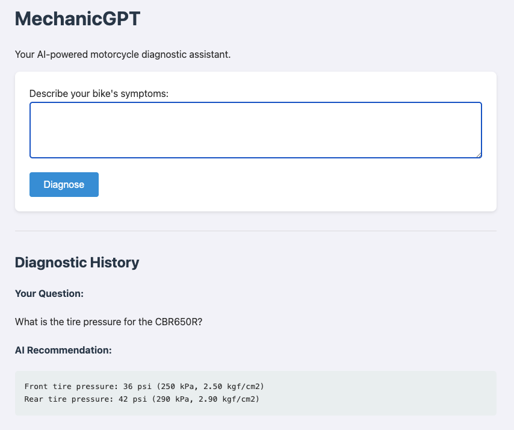
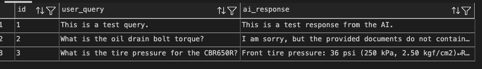

# MechanicGPT (Honda Edition)

**MechanicGPT (Honda Edition)** is an AI-powered motorcycle diagnostic tool that helps Honda bike owners identify and troubleshoot bike problems through intelligent symptom analysis and expert recommendations.

---

## Features

* **Smart Diagnostics:** Describe your Honda bike's symptoms and get instant AI-powered analysis
* **Expert Recommendations:** Receive detailed repair suggestions and maintenance tips specific to Honda models
* **User-Friendly Interface:** Clean, responsive web interface for easy interaction
* **Diagnostic History:** Track your past queries and solutions
* **Honda-Only Focus:** Optimized for Honda models for higher accuracy and faster insights

---

## Tech Stack

*   **Programming Language:** Python, SQL
*   **Backend:** Flask, SQLAlchemy
*   **Database:** PostgreSQL
*   **AI:** LangChain with Google Gemini
*   **Pattern:** Retrieval-Augmented Generation (RAG)
*   **Embedding Model:** Hugging Face `all-MiniLM-L6-v2`
*   **Vector Store:** ChromaDB
---

## Getting Started

### Prerequisites

- Python 3.10+
- PostgreSQL
- Git

### Setup

1.  **Clone the repository:**
    ```bash
    git clone https://github.com/ChandanHegde07/MechanicGPT-Honda
    cd MechanicGPT-Honda
    ```

2.  **Create and activate a virtual environment:**
    ```bash
    python -m venv .venv
    source .venv/bin/activate
    ```

3.  **Install dependencies:**
    ```bash
    pip install -r requirements.txt
    ```

4.  **Set up the database:**
    -   Follow the instructions in `setup.sql` to create the database and user.
    -   Create a `.env` file and configure your `DATABASE_URL` and `GOOGLE_API_KEY`.

5.  **Add Knowledge Documents:**
    -   Create a folder named `data` in the root of the project.
    -   **Important:** Due to copyright, service manuals are not included in this repository. You must acquire your own PDF service manuals and place them inside the `data` folder for the AI to use.

---

## Demo

Here is a look at the application in action.

**Main Interface & Diagnostic History:**
*The application provides a clean interface for asking questions and displays a complete history of past diagnostics.*


**Database Verification:**
*Each query and AI response is successfully persisted in the PostgreSQL database.*


---

**Building for the motorbike community and workshop professionals.**